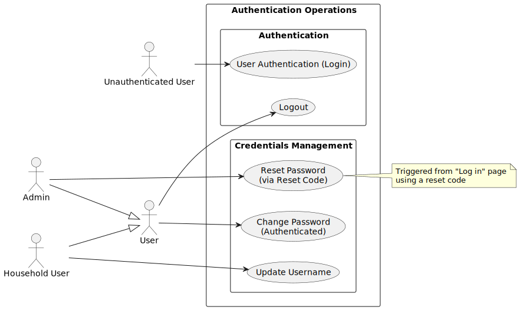
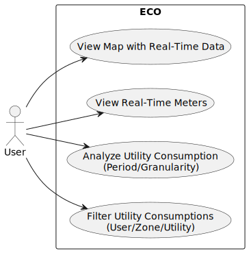
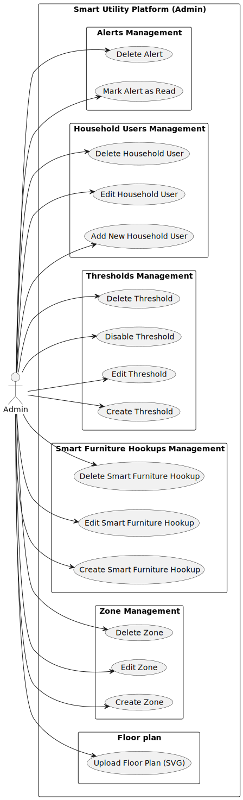

# Business Requirements

1. The admin must be able to **configure a house** by defining the floor plan, zones, and smart furniture hookups.
2. The platform must display a **map** with real-time status and utility consumptions of smart furniture hookups.
3. The platform must provide **real-time data** of current utilities consumption.
4. The platform must allow access to **historical data** of utilities consumptions.
5. The platform must notify admin when **forecasted consumption exceeds** thresholds through an automatic alert system.
6. The platform must notify admin when defined **consumption thresholds are exceeded**, through an automatic alert
   system.
7. The platform must allow **filtering of utility consumptions** by individual users and zones.

## Use Cases Authentication Operations

### Authentication
1. **User Authentication**
    - **Actor:** User
    - **Description:**  The user supply the credentials to access the system.
    - **Trigger:** The user accesses the platform without an existing authentication session.
    - **Preconditions:**
        - The platform is accessed for the first time.
        - A user account with credentials exists.
    - **Postconditions:**
        - The user is successfully authenticated.
    - **Main Success Scenario:**
        1. The user navigates to the login page.
        2. The user enters his credentials.
        3. The user submits the login form.
        4. The system validates the credentials.
        5. The system authenticates the user and establishes an authenticated session.
    - **Exception Scenario:**
        - **Step c:** If the user enters invalid credentials, the system displays an error message and prompts the user
          to re-enter the information.
3. **Logout**
    - **Actor:** User
    - **Description:** The user logs out of the platform.
    - **Trigger:** The user clicks the logout button.
    - **Preconditions:**
        - The user is authenticated.
    - **Postconditions:**
        - The session is terminated.
        - The data provided in the setup process are lost.
        - The user is redirected to the login page.
    - **Main Success Scenario:**
        1. The user clicks the "Logout" button.
        2. The system terminates the session.
        3. The system deletes all the data created by the user.
        4. The system redirects the user to the login page.
### Credentials management
1. **Reset Password**
    - **Actor:** Admin
    - **Description:** The admin resets their password using a reset code.
    - **Trigger:** The admin clicks the “Reset Password” button in the "Log in" page.
    - **Preconditions:**
        - The admin knows the reset password code.
    - **Postconditions:**
        - The admin's password is updated.
    - **Main Success Scenario:**
        1. The admin accesses the "Reset Password” page.
        2. The admin is prompted to enter the new password and the reset code.
        3. The system validates the data.
        4. The system updates the admin's password.
    - **Exception scenario:**
        - If the reset code is invalid, the system prompts the user to correct and enter it again.
2. **Update username**
    - **Actor:** Household user
    - **Description:** The household user changes his own username.
    - **Trigger:** The household user accesses the “Account” page and clicks the “Update username” button.
    - **Preconditions:**
        - The user is authenticated.
    - **Postconditions:**
        - The user username is changed.
    - **Main Success Scenario:**
        1. The user accesses the "Account" page.
        2. The user selects the "Change Username" option.
        3. The system prompts the user to enter the new username.
        4. The user enters the new username.
        5. The user clicks the "Update" button.
        6. The system validates that the new username is unique and valid.
        7. The system updates the username.
        8. The system displays a success message indicating the username has been changed.
    - **Exception scenarios:**
        - If the entered name already exists, the system displays an error message requesting a different username.
3**Change password**
    - **Actor:** User
    - **Description:** The user changes his own password.
    - **Trigger:** The user accesses the “Account” page.
    - **Preconditions:**
        - The user is authenticated.
    - **Postconditions:**
        - The user password is changed.
    - **Main Success Scenario:**
        1. The user accesses the "Account Settings" page.
        2. The user selects the "Change Password" option.
        3. The system prompts the user to enter the current password, the new password.
        4. The user enters the required credentials.
        5. The user clicks the "Update" button.
        6. The system validates that the current password is correct.
        7. The system updates the password.
        8. The system displays a success message indicating the password has been changed.

        - **Exception Scenario:**
            - **Step d:** If the user enters the wrong current password, the system displays an error message and
              prompts the user to re-enter the information.

## Use Cases User Operations

### Monitoring utility consumption
1. **Filter Utility Consumptions**
    - **Actor:** User
    - **Description:** The user filters the visible utility data by specific criteria: Utility, Household User, and/or
      Zone.
    - **Trigger:** The user clicks the “Filter” button.
    - **Preconditions:**
        - The user is authenticated.
        - Data exists for the requested entities.
    - **Postconditions:**
        - The current data visualization updates to reflect only the data matching the selected filters.
    - **Main Success Scenario:**
        1. The user accesses the platform.
        2. The user clicks the “Filter” button.
        3. The system presents options for:
            1. Utility type
            2. Household User username
            3. Zone name
        4. The user selects a filter.
        5. The user clicks "Apply Filters".
        6. The system validates the selection.
        7. The system applies the filter and refreshes the display to show only that consumption data that matches
           the filters.
2. **Analyze Utility Consumption**
    - **Actor:** User
    - **Description:** The user views utility consumption trends by selecting a specific period of time and the granularity of the data.
    - **Trigger:** The user changes the date range or granularity settings.
    - **Preconditions:**
        - The user is authenticated
        - Some utility consumptions are recorded.
    - **Postconditions:**
        - The current data visualization updates to reflect the specific time frame and detail level requested.
    - **Main Success Scenario:**
        1. The user accesses the platform.
      2. The user selects a Period of Time.
      3. The user selects the Data Granularity.
      4. The system select data based on time period and aggregates them based on the selected granularity.
      5. The system applies the settings and refreshes the display to show only that consumption data that matches
         the filters.

3. **View Real-Time Utility Meters**
    - **Actor:** User
    - **Description:** The user views the real-time utility meters.
    - **Trigger:** The user navigates to the "Meters" section of the platform.
    - **Preconditions:**
        - The user is authenticated.
        - At least one smart furniture hookup is transmitting his utility consumptions.
    - **Postconditions:**
        - The system displays live values for the utility types.
    - **Main Success Scenario:**
        1. The user accesses the "Meters" section of the platform.
        2. The system connects to the live data stream.
        3. The system displays the current live values for Water, Gas, and Electricity.
        4. The system automatically refreshes the values to reflect real-time usage.

4. **View Map with Real-Time Data**
    - **Actor:** User
    - **Description:** The user views the map.
    - **Trigger:** The user navigates to the "Map" section of the platform.
    - **Preconditions:**
        - The user is authenticated.
        - At least one smart furniture hookup is transmitting his utility consumptions.
    - **Postconditions:**
        - The system displays the map with status and utility consumptions of the smart furniture hookups.
    - **Main Success Scenario:**
        1. The user accesses the "Map" section of the platform.
        2. The system connects to the live data stream.
        3. The system refreshes the map to show which smart furniture hookups are active and how much are consuming.
        4. The system automatically refreshes the status and consumption values to reflect real-time usage.
## Use Cases Admin Operations

### Upload Floor Plan

1. **Upload Floor Plan**
    - **Actor:** Admin
    - **Description:** The admin uploads a digital floor plan (SVG format) to initiate the setup process.
    - **Trigger:** The admin accesses the “Upload Floor Plan” page.
    - **Preconditions:**
        - The SVG file representing the floor plan is already available in the admin’s file system.
    - **Postconditions:**
        - The floor plan is successfully stored.
    - **Main Success Scenario:**
        1. The admin accesses the "Upload Floor Plan" page.
        2. The admin clicks the “Select file” button.
        3. The system prompts the admin to provide a digital floor plan in SVG format.
        4. The admin selects an SVG file from the local system.
        5. The system uploads and renders a preview of the file.
        6. The admin confirms the upload.
        7. The system saves the floor plan.
    - **Exception Scenario:**
        - **Step d:** If the uploaded file is not in SVG format or is invalid,
          the system displays an error message and prompts the admin to upload a valid file.

### Zone management

1. **Create Zone on Floor Plan**
    - **Actor:** Admin
    - **Description:** The admin creates zones by drawing polygon on the uploaded floor plan, naming each zone and
      customizing its color.
    - **Trigger:** The admin accesses the “Manage Zones” page.
    - **Preconditions:**
        - The admin is authenticated and in the setup process.
        - An SVG floor plan has been uploaded to the system.
    - **Postconditions:**
        - A new zone is added to the floor plan with a defined shape, name, and color.
        - If a smart furniture hookup lies within the created zone it will be automatically assigned to that zone.
    - **Main Success Scenario:**
        1. The admin accesses the "Manage Zones" page.
        2. The admin clicks “Add New Zone.”
        3. The admin draws a polygon on the map.
        4. The admin enters a zone name.
        5. The admin clicks the “Create” button.
        6. The system validates the provided information.
        7. The system adds the zone to the floor plan.
        8. The system saves the zone and updates the floor plan.
    - **Alternative Paths:**
        - **After step 3 – The admin chooses a zone color:**
            - The admin selects a different color.
            - Continue from Step 4.
    - **Exception Scenarios:**
        - If the drawn zone overlaps with an existing one, the system displays an error and prevents confirmation until
          the overlap is resolved.
        - The admin discards the zone.
        - The admin skips this phase entirely.

2. **Edit Existing Zone**
    - **Actor:** Admin
    - **Description:** The admin, while in the “Manage Zones” page, modifies a previously created zone by changing its
      name, shape, position, or color.
    - **Trigger:** The admin clicks the “Edit” button of a zone in the list of zones.
    - **Preconditions:**
        - The admin is authenticated.
        - At least one zone has already been created.
    - **Postconditions:**
        - The selected zone is updated with the new properties.
        - If the zone changes position or shape and a smart furniture hookup lies within the modified zone, it will be
          automatically assigned to that zone.
        - If the zone changes position or shape and a smart furniture hookup lies within the modified zone, it will be
          automatically unassigned from that zone.
    - **Main Success Scenario:**
        1. The admin accesses the "Manage Zones" page.
        2. The admin locates the zone to be edited in the list.
        3. The admin clicks on the "Edit" button/icon associated with the zone in the list of created zones.
        4. The admin edits the name, color, position, and/or shape.
        5. The admin confirms the changes.
        6. The system updates the zone and reflects the changes on the map.
    - **Exception Scenarios:**
        - The edited shape overlaps with another zone. The system shows an error and prevents saving until the overlap
          is resolved.
        - The admin can discard the changes.

3. **Delete Zone**
    - **Actor:** Admin
    - **Description:** The admin, while in the “Manage Zones” pae, deletes an existing zone.
    - **Trigger:** The admin clicks the “Delete” button of a zone in the list of zones.
    - **Preconditions:**
        - The admin is authenticated.
        - At least one zone has already been created.
    - **Postconditions:**
        - The selected zone is removed from the system.
        - The selected zone is removed from the floor plan, and all its associated smart furniture hookups are
          reassigned to the floor plan.
    - **Main Success Scenario:**
        1. The admin accesses the "Manage Zones" page.
        2. The admin locates the zone to be deleted in the list of zones.
        3. The admin clicks the “Delete” button/icon associated with the zone.
        4. The admin confirms the deletion.
        5. The system removes the zone.
        6. The system updates the zones list and the map to reflect the deletion.

### Smart Furniture Hookups Management

1. **Create Smart Furniture Hookups**
    - **Actor:** Admin
    - **Description:** The admin assigns a smart furniture hookup to the floor map by providing its name and endpoint
      within the setup process.
    - **Trigger:** The admin accesses the “Manage Smart Furniture Hookups” page.
    - **Preconditions:**
        - The admin is authenticated.
        - The admin knows the endpoint of the smart furniture hookup.
    - **Postconditions:**
        - A new smart furniture hookup is created.
        - If the smart furniture hookup is within a zone, it will be automatically assigned to it.
    - **Main Success Scenario:**
        1. The admin accesses the "Manage Smart Furniture Hookups" page.
        2. The admin clicks the "Create New Smart Furniture Hookup" button.
        3. The system opens a creation form.
        4. The admin is prompted to enter the smart furniture hookup’s name and endpoint.
        5. The admin adjusts the smart furniture hookup’s position.
        6. The admin clicks the "Done" button.
        7. The system validates the data.
        8. The system saves the smart furniture hookup information and updates the map.
    - **Exception Scenario:**
        - If the entered endpoint is not reachable or is invalid, the system displays a warning message indicating that
          the endpoint is unreachable.

2. **Edit Smart Furniture Hookup**
    - **Actor:** Admin
    - **Description:** The admin, while in the "Manage Smart Furniture Hookups" page, modifies a previously created
      hookup by changing its name or endpoint.
    - **Trigger:** The admin clicks the “Edit” button of a hookup in the list of hookups.
    - **Preconditions:**
        - The admin is authenticated.
        - At least one hookup has already been created.
    - **Postconditions:**
        - The selected hookup is updated with the new properties.
        - If the smart furniture hookup's new position is within a zone, it will be automatically assigned to it.
        - If the smart furniture hookup's new position is no longer within a zone, it will be automatically unassigned
          to it.
    - **Main Success Scenario:**
        1. The admin accesses the "Manage Smart Furniture Hookups" page.
        2. The admin locates the hookup to be edited in the list.
        3. The admin clicks the "Edit" button/icon associated with the hookup.
        4. The admin edits the name, position and/or endpoint.
        5. The admin confirms the changes.
        6. The system updates the hookup and reflects the changes on the map.
    - **Exception Scenario:**
        - If the entered endpoint is not reachable or is invalid, the system displays a warning message indicating that
          the endpoint is unreachable.

3. **Delete Existing Utility Hookups**
    - **Actor:** Admin
    - **Description:** The admin, while in the “Manage Smart Furniture Hookups” page, deletes an existing hookup.
    - **Trigger:** The admin clicks the “Delete” button of a hookup in the list of hookups.
    - **Preconditions:**
        - The admin is authenticated.
        - At least one hookup has already been created.
    - **Postconditions:**
        - The selected hookup is removed from the system.
    - **Main Success Scenario:**
        1. The admin accesses the "Manage Smart Furniture Hookups" page.
        2. The admin locates the hookup to be deleted in the list of hookups.
        3. The admin clicks the "Delete" button/icon associated with the hookup.
        4. The system displays a confirmation prompt.
        5. The admin confirms the deletion.
        6. The system removes the hookup from the floor plan.
        7. The system updates the hookups list and the map to reflect the deletion.

### Thresholds management

1. **Create Thresholds**
    - **Actor:** Admin
    - **Description:** The admin configures alert thresholds by creating a new threshold for a resource and entering the
      name, the type, the period, and a numeric limit.
    - **Trigger:** The authenticated admin access “Manage Thresholds” page.
    - **Preconditions:**
        - The admin is authenticated.
    - **Postconditions:**
        - A new threshold is created.
    - **Main Success Scenario:**
        1. The admin accesses the "Manage Thresholds" page.
        2. The admin clicks the "Create New Threshold" button.
        3. The system opens a threshold creation form.
        4. The admin is prompted to enter the threshold name.
        5. The admin is prompted to choose the threshold type between Actual, Historical, Forcast.
        6. The admin enters a numeric threshold.
        7. The admin clicks the "Done" button.
        8. The system validates the data.
        9. The system saves the thresholds.
    - **Alternative Path:**
        - If the admin choose the Historical or Forecast threshold is prompted to choose the threshold period.
    - **Exception Scenario:**
        - The data provided is invalid. The system displays an error message and prevents saving.
2. **Edit Threshold**
    - **Actor:** Admin
    - **Description:** The admin, while in the "Manage Thresholds" page, modifies a previously created threshold by
      changing the name, the type, the period, and/or the numeric limit.
    - **Trigger:** The admin clicks the “Edit” button of a threshold in the list of thresholds.
    - **Preconditions:**
        - The admin is authenticated.
        - At least one threshold has already been created.
    - **Postconditions:**
        - The selected threshold is updated with the new properties.
        - Future alerts will be triggered based on the updated values.
    - **Main Success Scenario:**
        1. The admin accesses the "Manage Thresholds" page.
        2. The admin locates the threshold to be edited in the list.
        3. The admin clicks the "Edit" button/icon associated with the threshold.
        4. The system opens the threshold editing form pre-filled with current data.
        5. The admin modifies the name, type, and/or numeric limit.
        6. The admin clicks the "Save Changes" button.
        7. The system validates the data.
        8. The system updates the threshold and returns the admin to the list view.
    - **Exception Scenario:**
        - The data provided is invalid. The system displays an error message and prevents saving.
3. **Disable Threshold**
    - **Actor:** Admin
    - **Description:** The admin temporarily deactivates a specific threshold without removing it from the system,
      preventing it from triggering alerts.
    - **Trigger:** The admin clicks the “Disable” (or status toggle) button of an active threshold.
    - **Preconditions:**
        - The admin is authenticated.
        - The target threshold is currently active.
    - **Postconditions:**
        - The threshold status is set to "Inactive".
    - **Main Success Scenario:**
        1. The admin accesses the "Manage Thresholds" page.
        2. The admin locates the active threshold in the list.
        3. The admin clicks the "Disable" button or toggles the status switch.
        4. The system updates the status of the threshold to inactive.
4. **Delete Threshold**
    - **Actor:** Admin
    - **Description:** The admin, while in the “Manage Thresholds” page, permanently removes an existing threshold
      configuration.
    - **Trigger:** The admin clicks the “Delete” button of a threshold in the list.
    - **Preconditions:**
        - The admin is authenticated.
        - At least one threshold exists.
    - **Postconditions:**
        - The selected threshold is removed from the system.
    - **Main Success Scenario:**
        1. The admin accesses the "Manage Thresholds" page.
        2. The admin locates the threshold to be deleted in the list.
        3. The admin clicks the "Delete" button/icon associated with the threshold.
        4. The system displays a confirmation prompt to prevent accidental deletion.
        5. The admin confirms the deletion.
        6. The system deletes the threshold record from the database.
        7. The system refreshes the list to reflect the deletion.

### Household Users management

1. **Add New Household Users**
    - **Actor:** Admin
    - **Description:** The admin, while in the “Manage Household Users” page, creates a household user account by
      providing a username and password.
    - **Trigger:** The admin accesses the "Manage Household Users" page.
    - **Preconditions:**
        - The admin is authenticated and in the setup process.
        - The admin knows the household user's username.
    - **Postconditions:**
        - A new user account is created.
    - **Main Success Scenario:**
        1. The admin accesses the "Manage Household Users" page.
        2. The admin clicks “Add New User.”
        3. The system opens a household user creation form.
        4. The admin is prompted to enter the username and password.
        5. The system validates the data.
        6. The system creates a new user.
    - **Exception scenarios:**
        - If the entered name already exists, the system displays an error message requesting a different username.
        - If required fields are missing or invalid, the system prompts the admin to correct the details before
          proceeding.

2. **Edit User**
    - **Actor:** Admin
    - **Description:** The admin, while in the "Manage Users” page, modifies a previously created user by changing its
      name or password.
    - **Trigger:** The admin clicks the “Edit” button of a user in the list of users.
    - **Preconditions:**
        - The admin is authenticated and in the setup process.
        - At least one user has already been created.
    - **Postconditions:**
        - The selected user is updated with the new properties.
    - **Main Success Scenario:**
        1. The admin accesses the "Manage Users" page.
        2. The admin locates the user to be edited in the list.
        3. The admin clicks on the "Edit" button/icon associated with that user.
        4. The system opens an edit form pre-populated with the user’s current details.
        5. The admin updates the user’s name and/or password.
        6. The admin submits the changes by clicking the “Done" button.
        7. The system validates the updated information.
        8. The system updates the user’s details and updates the user list to reflect the edit.
    - **Exception scenarios:**
        - If the entered name already exists, the system displays an error message requesting a different username.
        - If required fields are missing or invalid, the system prompts the admin to correct the details before
          proceeding.

3. **Delete User**
    - **Actor:** Admin
    - **Description:** The admin, while in the "Manage Users” page, deletes an existing user.
    - **Trigger:** The admin clicks the “Delete” button of a user in the list of users.
    - **Preconditions:**
        - The admin is authenticated and in the setup process.
        - At least one user has already been created.
    - **Postconditions:**
        - The selected user account is removed from the system.
        - The user no longer appears in the list.
    - **Main Success Scenario:**
        1. The admin accesses the "Manage Users" page during setup.
        2. The admin locates the user to be deleted in the list.
        3. The admin clicks on the "Delete" button/icon associated with that user.
        4. The system prompts the admin for confirmation.
        5. The admin confirms the deletion.
        6. The system validates the confirmation and deletes the user account.
        7. The system updates the user list to reflect the removal.

### Alerts management

1. **Mark as read**
    - **Actor:** Admin
    - **Description:** The admin changes the status of a specific system-generated alert from "Unread" to "Read".
    - **Trigger:** The admin clicks the “Mark as Read” button/icon next to an alert or opens the alert details.
    - **Preconditions:**
        - The admin is authenticated.
        - There is at least one unread alert in the system.
    - **Postconditions:**
        - The alert status is updated to "Read".
        - The global counter of unread notifications is decremented.
    - **Main Success Scenario:**
        1. The admin accesses the "Manage Alerts" page.
        2. The system displays a list of alerts.
        3. The admin locates an unread alert.
        4. The admin clicks the "Mark as Read" button.
        5. The system updates the alert's status to "Read".
2. **Delete Alert**
    - **Actor:** Admin
    - **Description:** The admin changes removes an alert.
    - **Trigger:** The admin clicks the “Delete” button associated with a specific alert.
    - **Preconditions:**
        - The admin is authenticated.
        - At least one alert exists in the system.
    - **Postconditions:**
        - The selected alert is permanently removed from the system.
    - **Main Success Scenario:**
        1. The admin accesses the "Manage Alerts" page.
        2. The admin locates the alert to be deleted.
        3. The admin clicks the "Delete" button/icon associated with the alert.
        4. The system removes the alert from the database.
        5. The system refreshes the list to reflect the removal.

