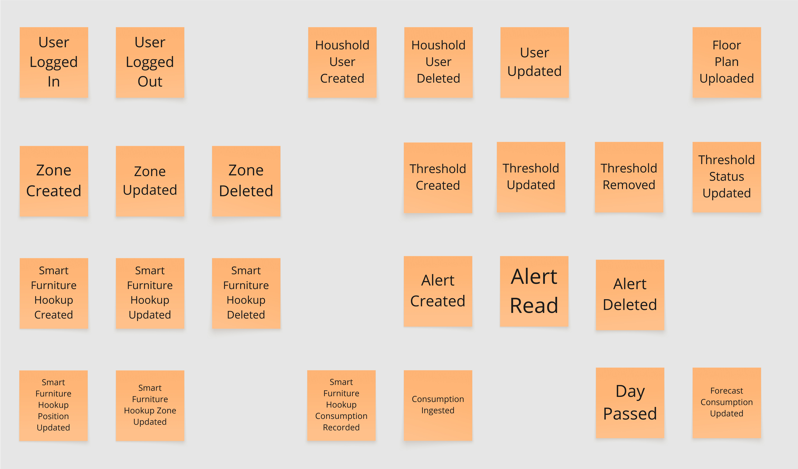
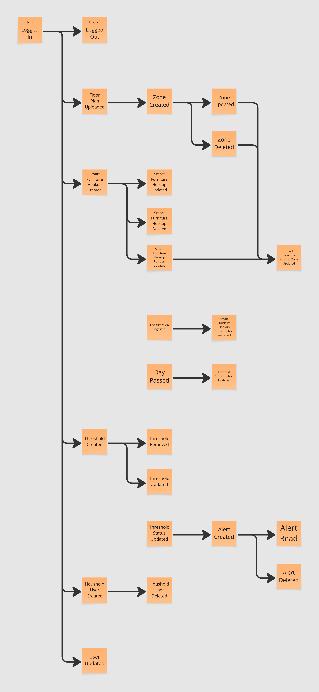
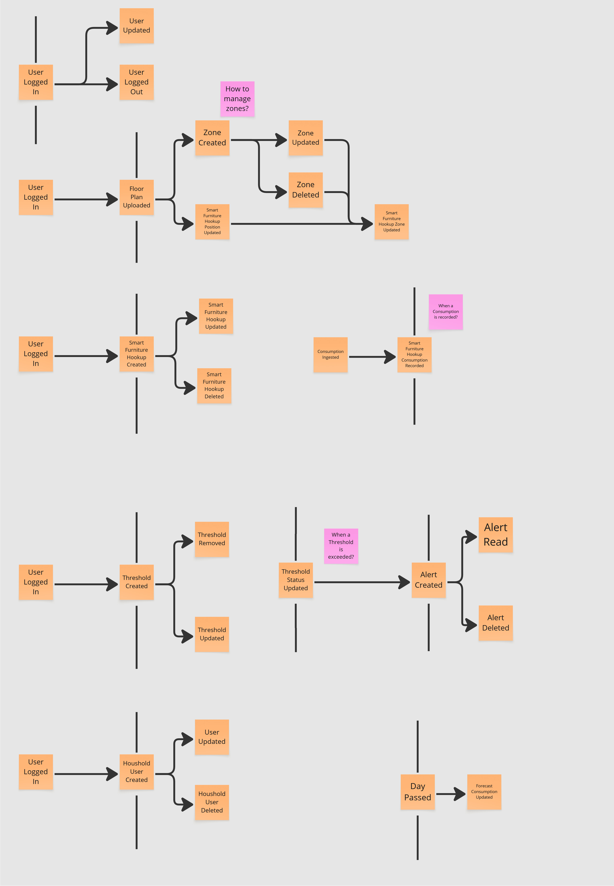
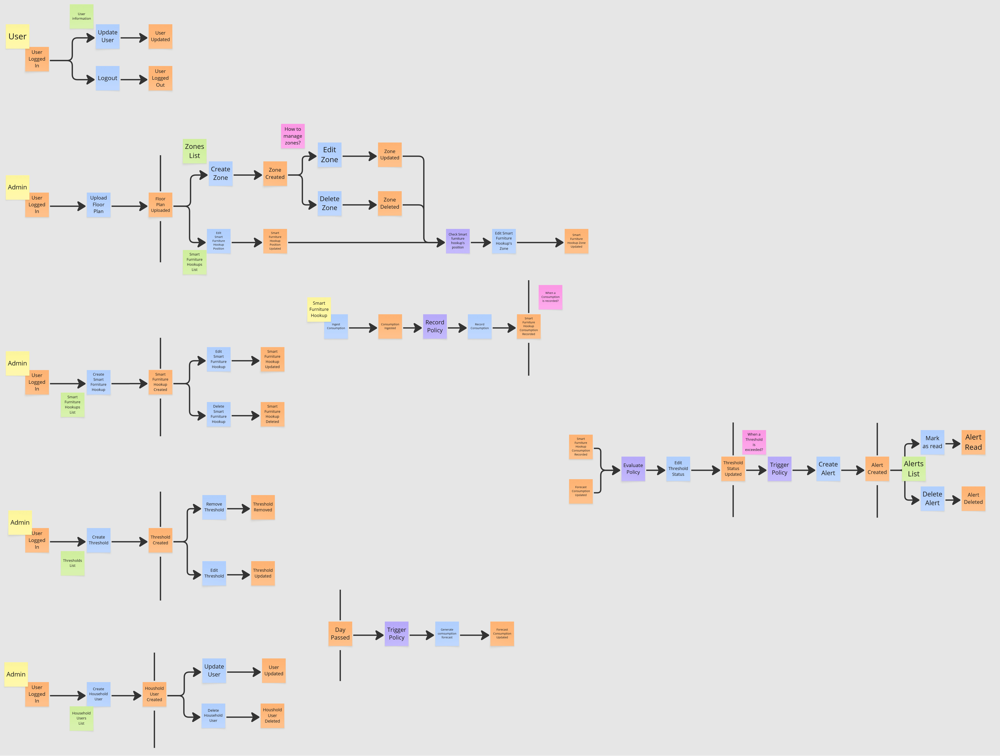
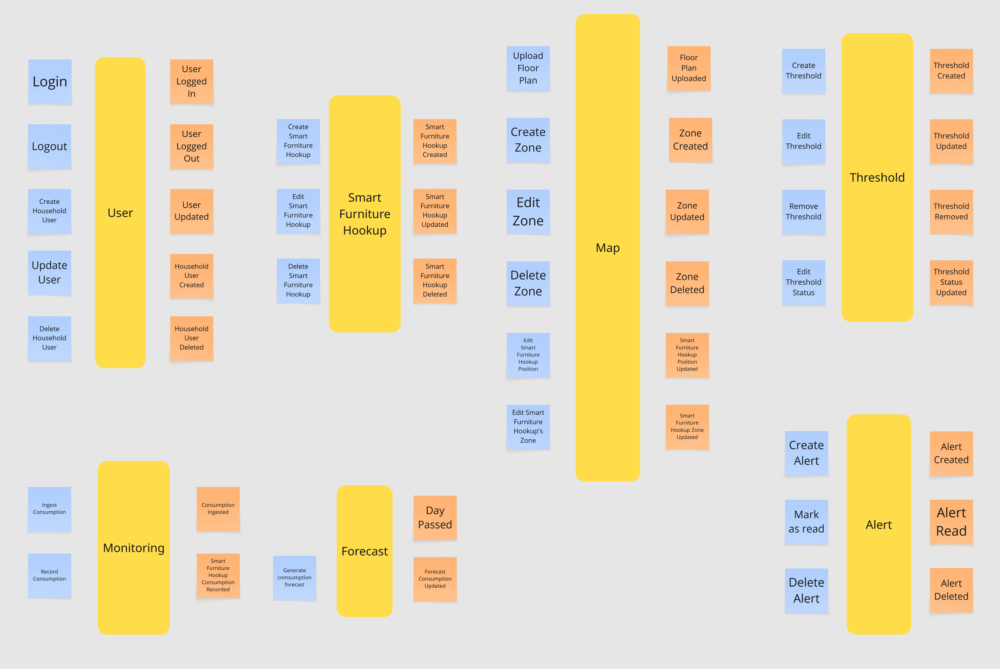
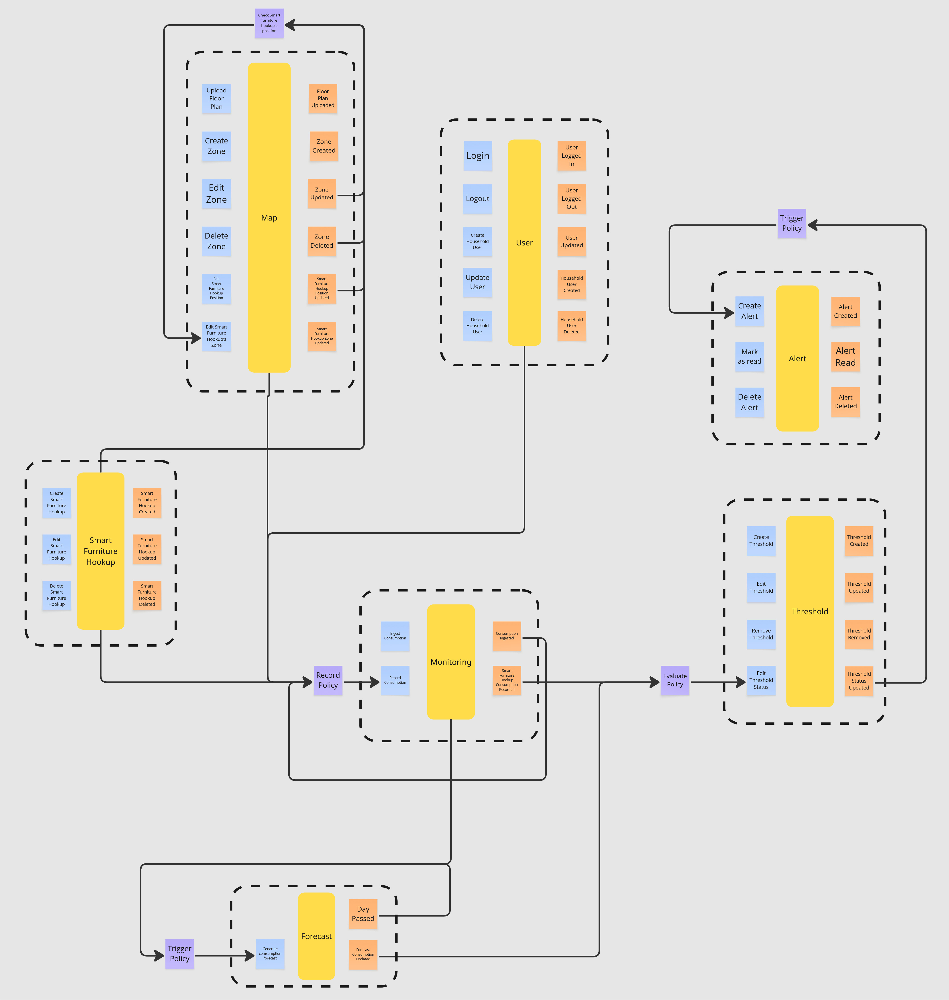

# Event Storming    
The knowledge-crunching session was primarily organized using the Event Storming approach, along with requirements analysis.
To start the event storming, the team first identified a group of domain experts: a research group from the University of Bologna (UniBo).

# Step 1: Unstructured Exploration
First, the domain is explored through brainstorming in order to identify the main events (orange notes), without considering their order.

# Step 2: Timeline
Then, the events are ordered by time, and arrows are used to indicate their dependencies.

# Step 3: Pain Points and Pivotal Events
In this step, the team examines the overall domain to identify pain points (pink notes) and key business events (orange notes with black line) indicating
a change in context or phase.

# Step 4: Commands, Policies and Read Models
Finally, to gain a complete understanding of the domain elements, the flow of events is further enriched with:
- **Commands (light blue notes):** actions that trigger events/flow of events;
- **Actors (yellow notes):** entities that perform commands;
- **Policies (purple notes):** rules that trigger the execution of a command after an event;
- **Read Models (green notes):** data accessed by the actor to support the actor’s decision.

# Step 5: Aggregates
Once all the events and commands are represented, the team members organizing related concepts in aggregates.

# Step 6: Bounded Contexts
The final step of the EventStorming session involved identifying bounded contexts by analyzing the aggregates and their interactions.

