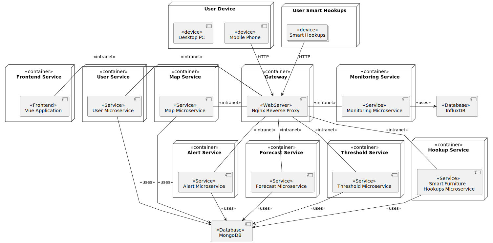

# Architecture

After identifying the bounded contexts and the main components of the system, a microservice architecture was chosen.
Microservice architecture is a design pattern that structures an application as a collection of small, autonomous,
and loosely coupled services, each implementing a specific business capability. adopting this architectural style supports
continuous delivery and deployment of large and complex applications. 

## Microservices Decomposition
The decomposition strategy that we used is by bounded contexts. Here are the services that we identified:
- **User service:** It will handle the User Context functionalities and exposes them through RESTful API endpoints.
  - Communication with other services:
    - It should act as the central authority to validate authentication tokens for all request authorizations in other services.
- **Smart Furniture Hookup service:** It will handle the Smart Furniture Hookup Context functionalities and exposes them through RESTful API endpoints.
    - Communication with other services:
      - It should forward requests to Monitoring Service to register a new smart furniture hookup.
- **Map service:**  It will handle the Map Context functionalities and exposes them through RESTful API endpoints.
  - Communication with other services:
      - It should always check if the smart furniture hookup exists in the Smart Furniture Hookup Service before allowing it to be added to the map.
- **Monitoring service:** It will handle the Monitoring Context functionalities and exposes them through RESTful API endpoints and WebSockets.
  - Communication with other services:
    - It should always check if the smart furniture hookup exists in the Smart Furniture Hookup Service before registering its related utility consumption.
    - It should always check in the Map Service if the smart furniture hookup is within a zone to enrich the measurement with spatial data.
    - It should always check in the User Service if a household user exists when a username is provided in the measurement.
- **Forecasting service:** It will handle the Forecasting Context functionalities and exposes them through RESTful API endpoints.
    - Communication with other services:
      - It should periodically fetch historical utility consumptions from the Monitoring Service via REST API endpoints to train/update its models.
      - It should send requests to the Threshold Service to submit generated forecast aggregations for the evaluation of forecasted thresholds
- **Threshold service:**  It will handle the Threshold Context functionalities and exposes them through RESTful API endpoints.
  - Communication with other services:
    - It should consume utility meter data from the Monitoring Service in real-time via WebSockets to evaluate active rules.
    - It should send requests to Alert Service to notify when a threshold is exceeded.
- **Alert service:** It will handle the Alert Context functionalities and exposes them through RESTful API endpoints and SSE.

## User interaction
A frontend application will be developed to interact with the system. This application will serve as the user-facing platform,
consuming the RESTful APIs exposed by the backend microservices and establishing connections via WebSockets for real-time communication.
The REST APIs and WebSockets are exposed to external clients through a reverse proxy, which is responsible for routing incoming requests to the
appropriate backend services.

## Deployment View
The system will be deployed using Docker containers. Each microservice is containerized and the orchestration of the containers 
will be done using Docker Compose.

