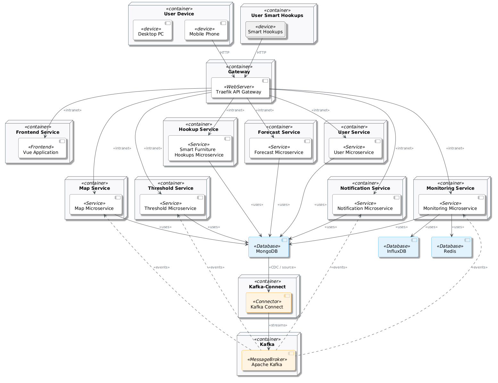

# Architecture

After identifying the bounded contexts and the main components of the system, a microservice architecture was chosen.
Microservice architecture is a design pattern that structures an application as a collection of small, autonomous,
and loosely coupled services, each implementing a specific business capability. adopting this architectural style supports
continuous delivery and deployment of large and complex applications. 

## Microservices Decomposition
The decomposition strategy that we used is by bounded contexts. Here are the services that we identified:
- **User service:** It will handle the User Context functionalities and exposes them through RESTful API endpoints.
- **Smart Furniture Hookup service:** It will handle the Smart Furniture Hookup Context functionalities and exposes them through RESTful API endpoints.
- **Map service:**  It will handle the Map Context functionalities and exposes them through RESTful API endpoints.
- **Monitoring service:** It will handle the Monitoring Context functionalities and exposes them through RESTful API endpoints and WebSockets.
- **Forecasting service:** It will handle the Forecasting Context functionalities and exposes them through RESTful API endpoints.
- **Threshold service:**  It will handle the Threshold Context functionalities and exposes them through RESTful API endpoints.
- **Notification service:** It will handle the Alert Context functionalities and exposes them through RESTful API endpoints and SSE.

## User interaction
A frontend application will be developed to interact with the system. This application will serve as the user-facing platform,
consuming the RESTful APIs exposed by the backend microservices and establishing connections via WebSockets for real-time communication.
The REST APIs and WebSockets are exposed to external clients through an API Gateway, which performing path-based routing,
prefix stripping, and centralised authentication.

## Component & Connector View
This section describes the components and connectors of the system and how they interact with each other.

### Database
Each microservice has a database to store persistent data. As we will see in the next chapter, each microservice will have its own database.
The database will be accessed by a repository adapter used by one or more services.

### External HTTP communication
When microservices need to communicate synchronously with external systems, such as another microservice or a metrics service, they do so using HTTP.
An external service adapter is used by one or more services to handle this HTTP communication.

### Publish events
To publish events, microservices will use the outbox pattern. 
An event publisher adapter, used by one or more services, will handle storing these events in the database.
These events are then picked up by a relay component and published to the broker topics.

### Consume events
When needed, a microservice will consume events from a broker and use the inbox pattern for deduplication.
To enable this, an event consumer adapter processes incoming messages from the broker, using one or more services to process the event and an
InboxRepository to save the event ID.

### HTTP REST API communication
Synchronous interactions with the outside world are handled via REST APIs by the API Gateway and redirected to the appropriate microservice.
Similarly, synchronous inter-service communication is also done using a REST API.

To enable this, a REST controller adapter provides the API endpoints and uses one or more services to process the requests.

### Proposed architecture for a microservice
Given the interactions and components discussed above, the following image presents a complete view of a microservice's components, divided into four layers.
This architectural division will be discussed in detail in the next chapter.

## Deployment View
The system is composed of the following infrastructural components:
- **API Gateway**: single entry point for client requests.
- **Microservices**: seven independently deployable services, each exposing a REST
API and, where applicable, consuming from and publishing to the message broker.
- **Message Broker**: durable publish-subscribe bus decoupling event producers from
consumers.
- **Document Database**: shared, replica-set-enabled database with per-service logical databases for isolation.
- **Time-Series Database**: dedicated database for high-frequency consumption writes
and temporal queries.
- **Redis Cache**: cache to store measurement tags to reduce repeated cross-service queries.
- **Change-Data-Capture Pipeline**: bridges database-level outbox events to the
message broker.
- **Observability Stack**: centralised collection point with separate backends for
metrics, logs, and traces, plus a unified dashboard.
- **Web Frontend**: single-page application delivered via the API gateway.

All components are deployed on a single machine within a virtualised network through
the use of Docker. The API gateway is the only component reachable from outside the
internal service network. Service discovery is achieved through DNS resolution provided
by the orchestration layer. A graphical overview of the system can be observed in the

The system will be deployed using Docker containers. Each microservice is containerized and the orchestration of the containers 
will be done using Docker Compose.

