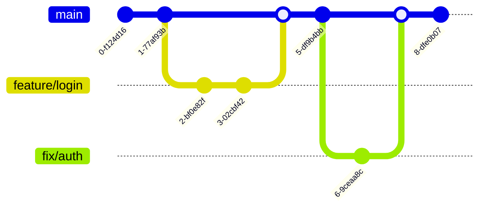
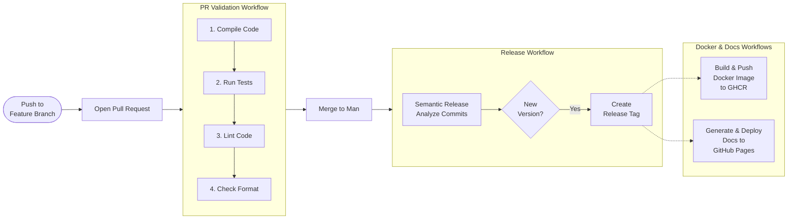

# DevOps

## License
The project is licensed under the [Apache License, Version 2.0](https://www.apache.org/licenses/LICENSE-2.0) because of its permissive nature and the fact that it is compatible with most open source licenses.

## Version Control
### DVCS Workflow

We utilize **Git** as our Distributed Version Control System. The development workflow adheres to the [**GitHub Flow**](https://docs.github.com/en/get-started/using-github/github-flow). This is a lightweight, branch-based workflow that supports teams in deploying regularly.

* **Main Branch:** The `main` branch always contains deployable, production-ready code.
* **Feature Branches:** New work is done on short-lived feature branches created from `main`. Once work is complete, it is merged back into `main` via a Pull Request, and the branch is automatically deleted.

### Branch Organization

Since we follow GitHub Flow, we do not maintain a separate `develop` branch. All features, fixes, and chores originate from and merge directly back into `main`.



### Merge Strategy

To maintain a strictly linear project history, we use the **Rebase and Merge** strategy. When a Pull Request is merged, the commits from the feature branch are rebased onto the tip of `main`. This avoids the creation of "merge commits" and ensures that the history remains flat and easy to read.

### Protection Rules

To ensure the integrity and security of the codebase, we enforce strict rules on the `main` branch and throughout the repository:

* **Pull Request Required:** Direct pushes to `main` are prohibited. All changes must be submitted via a Pull Request to ensure automated validation.
* **Signed Commits:** We enforce **verified signatures** globally. Commits pushed to any branch (excluding `gh-pages`) must be cryptographically signed, preventing author impersonation.
* **Linear History:** To align with our rebase strategy, we enforce a linear history on `main`. Merge commits are blocked to ensure a clean and traceable timeline.
* **Status Checks:** Pull Requests cannot be merged unless the required validation workflow completes successfully.
* **Restricted Access:** The `main` branch is protected against accidental deletion and force pushes.

### Conventional Commits

We strictly enforce the **Conventional Commits** specification to maintain a structured and informative project history.

This is enforced locally via the `org.danilopianini.gradle-pre-commit-git-hooks` plugin, configured in the `settings.gradle.kts` file. This hook intercepts every commit attempt and validates the message format, rejecting any commit that does not adhere to the standard.

```kotlin
plugins {
    id("org.danilopianini.gradle-pre-commit-git-hooks") version "2.1.7"
}

gitHooks {
    // Enforces Conventional Commits standard on commit messages
    commitMsg {
        conventionalCommits()
    }
    createHooks(true)
}

```
### Semantic Versioning and Release
We use Semantic Versioning (SemVer) to version the software. The version number is computed during the build process through the "Git Sensitive
Semantic Versioning" Gradle Plugin configured with the "Conventional Commit Strategy for Git Sensitive Semantic Versioning" Gradle Plugin

To automate the release process, Semantic Release plugin has been integrated into the CI/CD pipeline. The plugin is empowered with 
"semantic-release-preconfigured-conventional-commit" configuration preset. The plugin automatically inspects the (conventional) commit messages,
determine the next version, produces a release version accordingly, and publishes it into the GitHub Releases.


## Project Scaffolding
To standardize the creation of new services and reduce setup time, we leverage GitHub Template Repositories.
This ensures that every new microservice adheres to our architectural standards and comes pre-equipped with the 
necessary build scripts and CI/CD workflows.

We maintain specific templates for our primary languages:

* **Template for Kotlin Projects:** It includes a pre-configured Gradle build, **Ktlint** for formatting, **Detekt** for static analysis, and **Dokka** for documentation generation.
* **Template for TypeScript Projects:** It is configured with **ESLint** and **Prettier** for code quality. Crucially, it wraps Node.js management within Gradle.

Both templates come pre-configured with the following architectural standards:

* **CI/CD Workflows:** Ready-to-use GitHub Actions for PR validation, Docker multi-arch builds, and documentation deployment.
* **Release Automation:** Fully configured **Semantic Release** to handle versioning, changelogs, and GitHub Releases.
* **Quality Gates:** Pre-commit hooks enforcing **Conventional Commits** and strict linting rules.
* **Dependency Management:** Automated dependency scanning and updates via **Renovate**.

## Build Automation
The project uses **Gradle** as the primary build automation tool, acting as a wrapper even for Node-based services.
This unifies the developer experience: a developer can build any service using standard Gradle commands without needing
to know any underlying scripts.

### Dependency Management

We use **Renovate** for automated dependency management. The configuration is defined in `renovate.json`, which extends the shared configuration presets (`DanySK/renovate-config`). Renovate scans `package.json` and `build.gradle.kts` files, automatically opening Pull Requests when dependencies are outdated.

## Continuous Integration and Delivery

To ensure that whenever changes are pushed to the repository the project remains in a stable state, and to automate the release of new software versions, we designed a comprehensive CI/CD pipeline. To achieve this goal, we leverage **GitHub Actions**.

### The CI/CD Pipeline

The pipeline is composed of distinct workflows that trigger based on specific events (Pull Requests, Merges, or Releases). Here is the list of the logical jobs that constitute our pipeline:

* **PR Validation**: This workflow is responsible for validating the codebase before any merge into the `main` branch. It ensures stability by running the following checks:
    1. **Build:** Compile the code.
    2. **Testing:** Executes tests.
    3. **Linting:** Runs static analysis tools (ESLint for JS, Ktlint for Kotlin) to detect code smells.
    4. **Check Format:** Verifies that the code style adheres to the project's formatting rules.

* **Release**: Triggered specifically when changes are merged into the `main` branch. It utilizes **Semantic Release** to analyze commit messages, compute the next version number, generate a changelog, and create a GitHub Release (tagging the repository).

* **Docker Build & Push**: This workflow triggers only after a release is published. It builds the Docker images for the services, supporting multi-architecture builds (AMD64 and ARM64) via QEMU and Docker Buildx. The resulting images are tagged with the semantic version and pushed to the **GitHub Container Registry (GHCR)**.

* **Documentation Deploy**: Running in parallel with the Docker build, this workflow generates the project documentation. It then deploys the generated static site to **GitHub Pages**, ensuring the documentation is always aligned with the latest released version.

