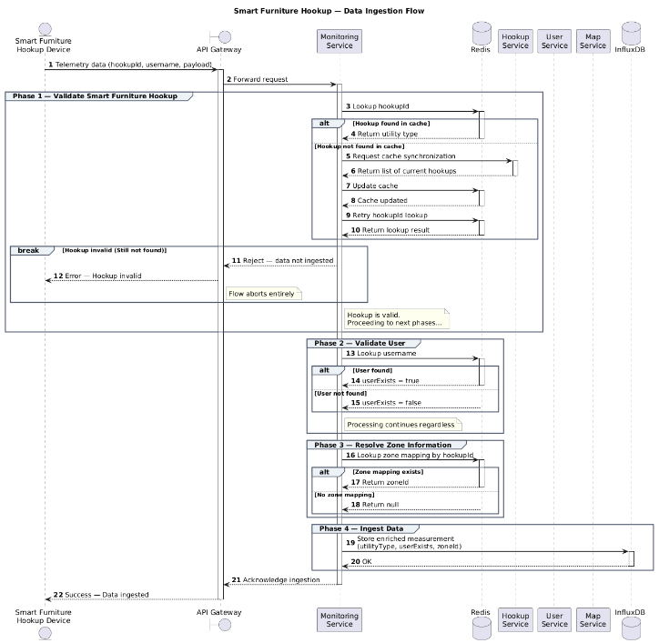
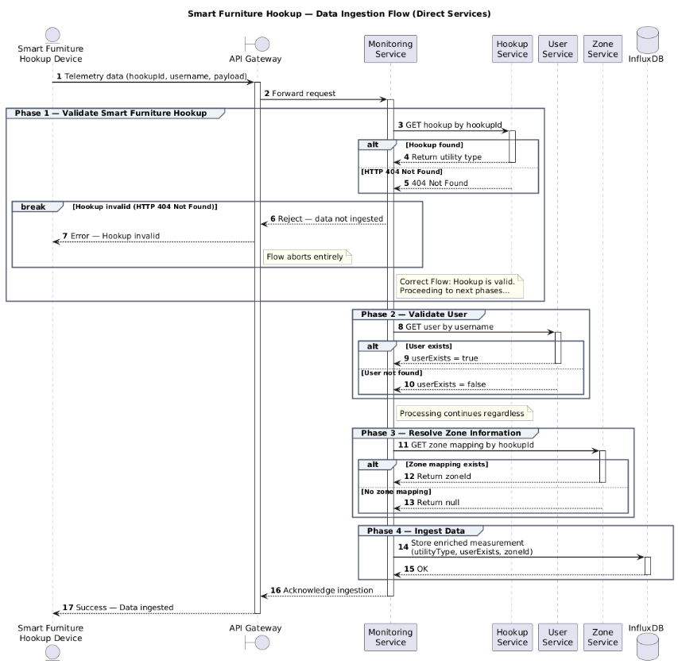
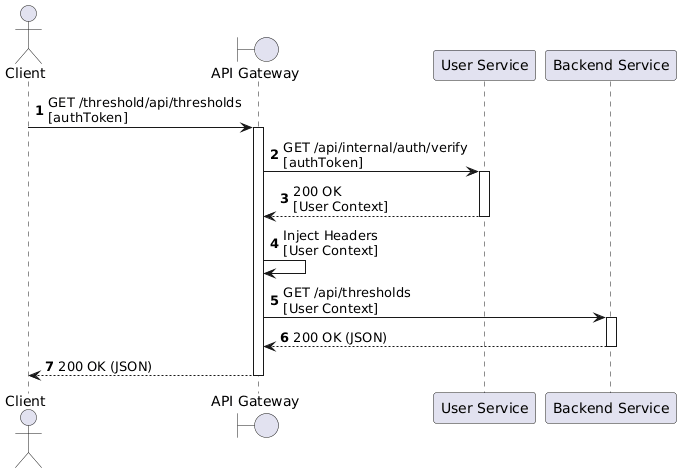
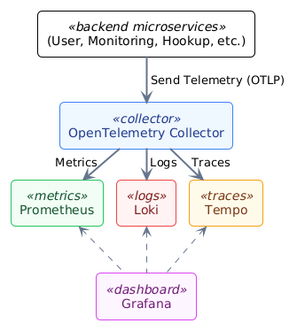

# Implementation

## Technologies Used

To realize the system, we used the **MEVN stack** (MongoDB, Express.js, Vue.js, Node.js).
Additionally, **Kotlin** and **InfluxDB** were employed to implement specific microservices where high performance or
time-series data management was required.
Below is the detailed breakdown of the technologies used for each part of the system:

* **API Gateway**
    * Tool: Traefik
    * Deployment: Docker
* **Frontend**
    * Language: JavaScript
    * SPA Framework: Vue.js 3
    * Build Tool: Vite
    * Web Server: Nginx
    * HTTP Communication: Axios
    * Real-time Communication: Socket.io
    * State Management: Pinia
    * UI: PrimeVue, Tailwind CSS
    * Deployment: Docker
* **User Microservice**
    * Language: TypeScript
    * Backend: Node.js and Express
    * Persistence: MongoDB
    * Event Communication: Kafka
    * Auth: JSON Web Token (JWT)
    * Deployment: Docker
* **Threshold Microservice**
    * Language: TypeScript
    * Backend: Node.js and Express
    * Real-time Communication: Socket.io
    * Persistence: MongoDB
    * Event Communication: Kafka
    * Deployment: Docker
* **Smart Furniture Hookup Microservice**
    * Language: TypeScript
    * Backend: Node.js and Express
    * Persistence: MongoDB
    * Event Communication: Kafka
    * Deployment: Docker
* **Map Microservice**
    * Language: TypeScript
    * Backend: Node.js and Express
    * Persistence: MongoDB
    * Event Communication: Kafka
    * Deployment: Docker
* **Forecast Microservice**
    * Language: Kotlin
    * Backend: JVM and Ktor
    * ML Library: Smile
    * Persistence: MongoDB
    * Event Communication: Kafka
    * Deployment: Docker
* **Monitoring Microservice**
    * Language: TypeScript
    * Backend: Node.js and Express
    * Real-time Communication: Socket.io
    * Event Communication: Kafka
    * Persistence: MongoDB and InfluxDB v2
    * Cache: Redis
    * Deployment: Docker
* **Notification Microservice**
    * Language: TypeScript
    * Backend: Node.js and Express
    * Persistence: MongoDB
    * Event Communication: Kafka
    * Deployment: Docker

### Key Technologies details

#### Ktor

For the implementation of the Kotlin-based web servers, we utilized the native **Ktor** framework. Ktor allows for the
creation of REST APIs in a modular and efficient manner, leveraging coroutines for the asynchronous management of HTTP
requests.

#### InfluxDB v2

To manage and persist the measurements originating from the physical hookups, we selected a database optimized for
time-series storage: **InfluxDB v2**. This choice was driven by both the need to handle high-frequency data streams and
the capability to perform complex filtering, transformation, and aggregation operations directly at the database level
using the functional scripting language **Flux**.

#### PrimeVue

To accelerate development timelines and ensure stylistic consistency, **PrimeVue** was adopted as the Vue.js component
library. Particular attention was paid to accessibility; PrimeVue declares conformity with **WCAG 2.1 level AA**.

#### Smile ML

For the `forecast-service`, Kotlin was chosen to leverage the **Smile** library during the prediction phase. This
combination allows machine learning algorithms to be executed efficiently within the JVM environment, resulting in
better performance—for this specific use case—compared to typical Python-based solutions.

### Redis

Redis Distributed Cache is an ultra-fast, in-memory, open-source data store used by applications to store frequently
accessed data in RAM across multiple servers.

By pulling data from memory instead of hitting slow databases, it drastically reduces latency and prevents system
bottlenecks.

## Event-Driven architecture

The microservices communicate asynchronously through a **Publish/Subscribe** model built on
**Apache Kafka**, which decouples producers from consumers. Kafka provides **at-least-once**
delivery, so the system is designed to tolerate duplicate messages — hence the *Outbox*
pattern when publishing and the *Inbox* pattern when consuming.

### Publishing — Transactional Outbox

Persisting a domain change and publishing its event are two separate writes (database +
broker). Doing them independently risks the **dual-write problem**, where one succeeds and the
other fails. To avoid it, the event is written to an `outboxevents` collection **inside the
same MongoDB transaction** as the domain change, so the two commit atomically. The publisher
requires an active `UnitOfWork` and fails fast otherwise.

```typescript
import type { DomainEvent } from "@domain/events/DomainEvent";

export interface EventPublisher {
  publish(event: DomainEvent): Promise<void>;
}
```
```typescript
export class MongoOutboxEventPublisher implements EventPublisher {
  readonly #logger?: Logger;

  constructor(logger?: Logger) {
    this.#logger = logger;
  }

  async publish(event: DomainEvent): Promise<void> {
    const session = mongoSessionContext.getStore();
    if (!session) {
      throw new Error(
        "EventPublisher must always be called inside an UnitOfWork",
      );
    }

    const activeSpan = trace.getActiveSpan();

    const envelope = new EventEnvelope({
      event,
      eventId: randomUUID(),
      correlationId: activeSpan?.spanContext().traceId,
    });

    this.#logger?.debug(
      {
        eventType: envelope.event.eventType,
        aggregateId: envelope.event.aggregateId,
        eventId: envelope.eventId,
        correlationId: envelope.correlationId,
      },
      "publishing outbox event",
    );

    await OutboxEventModel.create(
      [
        {
          eventId: envelope.eventId,
          aggregateId: envelope.event.aggregateId,
          aggregateType: envelope.event.aggregateType,
          eventType: envelope.event.eventType,
          occurredAt: envelope.event.occurredAt,
          payload: envelope.event.payload,
          correlationId: envelope.correlationId,
        },
      ],
      { session },
    );
  }
}
```

A **Kafka Connect** instance, running the **MongoDB source connector**, tails the outbox
collection and forwards committed events to Kafka. Outbox entries are then removed
automatically by a 7-day TTL index.

### Consuming — Idempotent Consumer (Inbox)

Consumers subscribe to a topic through a consumer group. Since delivery is at-least-once, the
same message may arrive twice. An **Inbox** repository deduplicates by atomically claiming each
`eventId` (backed by a unique index), so already-processed events are skipped — turning
at-least-once delivery into effectively **exactly-once processing**.

```typescript
const acquired = await this.#inbox.tryAcquire(message.eventId);
if (!acquired) return; // duplicate, already processed
```

### Error Handling — Retry & Dead Letter Queue

Transient failures are retried with **exponential backoff**. If retries are exhausted, or the
message is permanently invalid (malformed payload or unexpected event type), it is routed to a
**Dead Letter Queue** — a dedicated Kafka topic — instead of blocking the partition.

## Event-Driven Cache
### How the data are ingested and why we need cache
A Smart Furniture Hookup device sends telemetry data (hookup ID, username, and payload) to an API Gateway, which forwards it to a Monitoring service.
The Monitoring service then runs through three validation steps:
1. confirming the hookup exists,
2. checking whether the user is known,
3. resolving any zone the hookup belongs to.

Then, finally it can enrich the data with those results before storing it in InfluxDB.

To make these measurement tags quickly available when new consumption data is ingested, to reduce network traffic,
and avoiding repeated cross-service lookups, the Monitoring service maintains a cache containing hookup’s ID, household user’s
username, and the zone ID for each hookup on the map.

#### Behaviour
The cache is kept up to date through the microservices event-driven architecture by
listening for create, update, and delete events. If the broker is unavailable, the system
no longer updates the cache in real time.

When the broker it’s healthy, all lookups go
through Redis as a cache, with a fallback to the Hookup service to resync if needed.



If the broker it’s unhealthy, each step hits the relevant backend service directly, treating
timeouts or failures as graceful fallbacks rather than hard stops.


## Authentication

Regarding user authentification, the system implements a stateless mechanism relying on JSON Web Tokens (JWT) secured
within **HttpOnly cookies**. This choice was made to mitigate Cross-Site Scripting (XSS) vulnerabilities, as the tokens
are not accessible to client-side JavaScript.

**Server-Side Token Management**
We manage a dual-token lifecycle:

1. **Access Token:** Short-lived (approx. 1 hour) for immediate resource authorization.
2. **Refresh Token:** Long-lived (approx. 7 days) used to acquire new access tokens without requiring user
   re-credentials.

### Gateway-Level Enforcement

All client traffic enters the system through a single **Traefik** API Gateway, which routes
requests to the appropriate microservice by path prefix. Authentication is enforced centrally
at the gateway rather than being re-implemented in every service.

Protected routes are guarded by a shared **ForwardAuth** middleware: before forwarding a
request, the gateway issues a sub-request to the User Service's verification endpoint
(`/api/internal/auth/verify`), which validates the JWT carried in the HttpOnly cookie.

- If the token is valid, the User Service returns the caller's identity, which the gateway
  injects into the upstream request as trusted headers (`X-User-Id`, `X-User-Role`,
  `X-User-Username`). Downstream services consume these headers and never handle the raw token.
- If the token is missing or invalid, the gateway rejects the request immediately and the
  target service is never reached.

The gateway is configured to ignore client-supplied forwarding headers
(`trustForwardHeader=false`), so identity cannot be spoofed: the **User Service is the single
source of truth** for authentication. A small set of routes — login/refresh/logout, admin
password reset, and device measurement ingestion — are intentionally public and bypass this
middleware.



## Observability

The services are instrumented with **OpenTelemetry**, covering the three pillars — metrics,
logs, and traces. Each service exports telemetry over OTLP to a central **OpenTelemetry
Collector**, which routes every signal to a dedicated backend, all visualized in a single
**Grafana** instance:

- **Metrics → Prometheus:** runtime and custom *business metrics* (e.g. messages routed to the
  DLQ).
- **Logs → Loki:** structured **pino** logs, shipped through `pino-opentelemetry-transport`
  and correlated with the active trace.
- **Traces → Tempo:** automatic instrumentation plus manual spans on critical paths; a
  `traceparent` derived from the trace context lets a single operation be followed across
  services.

The Collector also filters out noisy spans (health checks, static assets, middleware) before
forwarding them.



## Wave Lab

In order to test the platform, a Python application was developed to simulate smart plugs.  
This application consists of a FastAPI-based web server, used to simulate the endpoints described in the introduction,
and a script dedicated to starting the simulations, during which the active devices periodically send consumption data.

To connect a plug to the system, it is necessary to send a `PATCH` request to the endpoint associated with the plug,
specifying the `endpoint_url` field.  
Once configured, the plugs respond by periodically sending requests of the following type:

```json
{
  realTimeConsumption
  ": 2,
  "username": "marco",
  "timestamp": "2026-01-21 18:32:37.891223"
}
```

### Main Components

The system is composed of three main components:

- `main.py`: runs a FastAPI web server used to mock the smart furniture hookup.
  It exposes endpoints to request device information and to configure the monitoring endpoint to which consumption data
  will be sent.

- `run_simulation.py`: simulates the behavior of the smart furniture hookup by periodically sending data for active
  nodes.
  The simulation uses a fixed consumption rate and allows basic configuration of the simulation parameters, e.g.
  associate a username
  to a smart furniture hookup.
- `wavelab.py`: provides a Command Line Interface (CLI) to interact with the system.
  It allows users to change the status of a node and retrieve information about the current state of the system.

> **Note**  
> This is a personal project developed solely for the purpose of testing the system. As such, it does not follow
> production-level
> best practices and lacks features such as CI/CD pipelines, containerization, and other supporting tools.

## Forecast

The core logic resides in `RandomForestForecast.kt`. The system utilizes the **Smile** (Statistical Machine Intelligence
and Learning Engine) library, leveraging the JVM's performance for mathematical operations. The chosen algorithm is a *
*Random Forest Regressor**, selected for its robustness against overfitting and ability to handle non-linear
relationships in time-series data.

The implementation employs a **Sliding Window** strategy to transform the time-series forecasting problem into a
supervised learning problem.
Key hyperparameters used in the model include approximately 100 trees and a maximum depth of 20, balancing computational
cost with prediction accuracy.

## Socket.io

To implement WebSocket-based communication, Socket.IO was chosen. Socket.IO is a library that enables real-time,
bidirectional,
and event-based communication between the browser and the server.

A security middleware has been added to the Socket.IO namespaces. This middleware interacts with the frontend client to
validate
connections and ensure that only authorized clients can establish and maintain secure socket connections.

Three main communication channels have been designed between the Monitoring Service and the various system components:

- `realTimeNamespace`: used by the frontend to obtain real-time data synchronized across multiple clients.
- `utilityConsumptionsNamespace`: used by the frontend to retrieve time series of consumption data.
- `utilityMetersNamespace`: used by the Threshold Service to retrieve various consumption counters.

### Strong Typing (TypeScript)

Socket.io TypeScript generics are used to define strongly typed communication interfaces.

<details>
<summary>Socket example</summary>

```Typescript
// Socket
export type UtilityConsumptionsSocket = Socket<
  UtilityConsumptionsClientEvents,
  UtilityConsumptionsServersEvents
>;

// client events
export type UtilityConsumptionsClientEvents =
  SubscribeUtilityConsumptionsEvent & EditUtilityConsumptionsQueryEvent;

export interface SubscribeUtilityConsumptionsEvent {
  subscribe: (queries: UtilityConsumptionsQueryDTO[]) => void;
}

export interface EditUtilityConsumptionsQueryEvent {
  editQuery: (queries: UtilityConsumptionsQueryDTO) => void;
}

// server events
export interface ErrorEvent {
  error: (error: string) => void;
}

export interface UtilityConsumptionsUpdateEvent {
  utilityConsumptionsUpdate: (
    data: UtilityConsumptionsQueryResultDTO[],
  ) => void;
}

export interface UtilityConsumptionsQueryUpdateEvent {
  utilityConsumptionsQueryUpdate: (
    data: UtilityConsumptionsQueryResultDTO,
  ) => void;
}
```

</details>

## Server-Sent Events (SSE)

We use **Server-Sent Events (SSE)** to deliver system alerts in real-time. This protocol was chosen because it is
lighter and simpler than WebSockets for one-way communication.

**Client Implementation Strategy:**
Instead of using standard libraries, we implemented a custom client using the native **Fetch API**. This decision
addresses specific limitations of the alternatives:

1. **Why not `Axios`?**
   Axios is designed to buffer the entire response in memory. For an infinite data stream, this causes memory leaks and
   performance issues. The `Fetch` API allows us to read the response as a **stream**, processing data chunk-by-chunk
   without filling the memory.
2. **Why not `EventSource`?**
   The standard `EventSource` API is too rigid for our needs. It does not support custom HTTP headers (limiting security
   flexibility) and forces its own reconnection logic. By using `fetch`, we have full control over the **retry strategy
   **.

**Message Parsing & Resilience**
The client reads the raw byte stream using a `TextDecoder` and splits incoming data by the standard double-newline
separator (`\n\n`) to identify messages.
To ensure stability, the `alertStore` manages the connection state, handling clean shutdowns via `AbortController` and
orchestrating reconnection attempts if the network fails.

## Influx Queries

To support more complex queries, Flux query builders have been implemented to optimally manage filters.
These builders allow:

- Filtering by `utilityType` (mandatory);
- Time-based filtering by specifying start and end timestamps;
- Filtering by user, by specifying a `username`;
- Filtering by zone, by specifying a `zoneID`;
- Setting a granularity level.

<details>
<summary>Query builder example</summary>

```typescript
// Example: query to retrieve a consumption time series

async
findUtilityConsumptions(
  utilityType
:
UtilityType,
  filter ? : TimeSeriesFilter,
  tagsFilter ? : TagsFilter,
):
Promise < UtilityConsumptionPoint[] > {
  const query = ConsumptionSeriesQueryBuilder.forBucket(
    this.influxDB.getBucket(),
  )
    .withUtility(utilityType)
    .withStart(filter?.from)
    .withStop(filter?.to)
    .withUser(tagsFilter?.username)
    .withZone(tagsFilter?.zoneID)
    .withWindow(filter?.granularity)
    .build();

  const result
:
ConsumptionPointModel[] =
  await this.influxDB.queryAsync(query);

return result.map((point) => ({
  value: point._value,
  timestamp: new Date(point._time),
}));
}

/*
Result example:

import "timezone"
option location = timezone.location(name: "Europe/Rome")

from(bucket: "monitoring")
  |> range(start: 2026-01-20T23:00:00.000Z)
  |> filter(fn: (r) =>
    r._measurement == "ELECTRICITY" and
    r._field == "value" and
    r.USERNAME == "marco" and
    r.ZONE_ID == "2887cb54-0fdc-400b-80d3-b6187c90ad4a"
  )
  |> window(every: 1h, createEmpty: true)
  |> group(columns: ["SMART_FURNITURE_HOOKUP_ID", "_start", "_stop"])
  |> integral(unit: 1h)
  |> group(columns: ["_start"])
  |> sum(column: "_value")
  |> duplicate(column: "_start", as: "_time")
  |> window(every: inf)
  |> keep(columns: ["_time", "_value"])
 */

```

</details>

## Onboarding

To set up the system, an onboarding phase was implemented. This process consists of the following steps:

1. Set up the floor plan
2. Create zones (_optional_)
3. Connect and place smart furniture hookups
4. Add household users (_optional_)
5. Configure thresholds (_optional_)

All of these steps are performed in the frontend and do not add any data to the system until the onboarding phase is
completed.

## Testing

Our testing strategy is organized as a **testing pyramid**: a broad base of fast, isolated
tests, narrowing towards fewer, broader tests that exercise more of the system. We use the
native frameworks best suited to each ecosystem — **Vitest** (TypeScript), **Kotest** with the
**Ktor `testApplication`**, **Supertest** for HTTP, and **Playwright** for
end-to-end testing.

### Unit Testing

Unit tests cover non-trivial logic in isolation across every architectural layer (domain,
application, infrastructure, presentation).

### Integration Testing

Integration tests verify that adapters work against the infrastucture service technology they wrap. For persistence, the TypeScript services run against an in-memory MongoDB
(`mongodb-memory-server`) started as a **replica set**, because the Outbox / Unit-of-Work
mechanism depends on MongoDB multi-document transactions. This validates repositories, the
inbox, and the transactional outbox against a real database.

### Component Testing

Component tests exercise a single microservice in isolation but fully wired together. The
entire application is composed in-process and driven through its real HTTP boundary with
**Supertest**, backed by an in-memory database, while external collaborators (the Kafka broker
and other services) are stubbed at the network edge. Besides the API behaviour, these tests
also cover resilience — for example, verifying that the Kafka consumer reconnects automatically
with exponential backoff after the broker goes down and recovers.

<details>
<summary>Component test example</summary>

```typescript
import {beforeAll, describe, expect, it} from "vitest";
import request from "supertest";

describe("POST /", () => {
  it("should create household user when admin provides valid data", async () => {
    const res = await request(app)
      .post(url)
      .set("Cookie", admin.authHeader)
      .send(mockHouseholdUserEmma);

    expect(res.status).toBe(201);
    expect(res.body.username).toBe(mockHouseholdUserEmma.username);
  });

  it("should return 403 when non-admin tries to create account", async () => {
    await request(app)
      .post(url)
      .set("Cookie", mark.authHeader)
      .send(mockHouseholdUserEmma)
      .expect(403);
  });

  it("should return 409 when username already exists", async () => {
    await request(app)
      .post(url)
      .set("Cookie", admin.authHeader)
      .send(mockHouseholdUserMark)
      .expect(409);
  });
});
```

</details>

### End-to-End Testing

At the top of the pyramid, end-to-end tests validate complete user journeys across the whole
running system. They are written with **Playwright** and run against the fully
containerized stack through the API Gateway, exactly as a real user would. The suite follows
the **Page Object Model**, groups specs by feature (authentication, onboarding, thresholds,
cross-service flows, …), and relies on global setup/teardown plus seeding helpers to bring the
system into a known state before each run.

In addition to this automated suite, **manual end-to-end testing** was also performed to
validate the overall user experience and catch issues hard to assert programmatically.

### Code Quality

To ensure maintainability and consistency across the codebase, static analysis tools have been integrated into the
development workflow:

* **Prettier (Typescript) / **Ktlint** (Kotlin) :** Enforces consistent code formatting.
* **ESLint** (TypeScript) / **Detekt** (Kotlin): Analyzes code to catch potential errors and enforce best practices.
